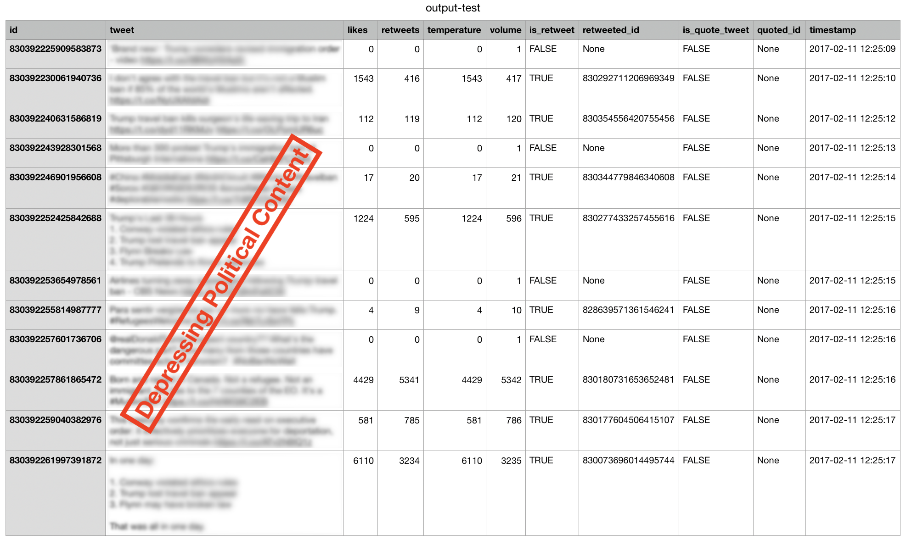

# Files

### Included:

* **classes.py** defines classes used in other scripts
* **hydrate.py** hydrates a `.txt` file of Tweet IDs into a new `.jsonl` file of full Tweet objects
* **tweets.py** processes a `.jsonl` file of Tweet objects and outputs a new `.csv` file of computed values
* **collate.py** processes a `.csv` file of Tweet values and outputs a new `.csv` file of summarised values per period _P_
* **entropy.py** processes a `.csv` file of summarised Tweet values and outputs a new `.csv`  file of calculated Shannon Entropy of topic over time
* **plotting.py** ...???

### Not included:

A file called **secrets.py** containing a declaration as follows...

```
from twarc import Twarc

def initialised_twarc_object():
    consumer_key = "<your Twitter app API consumer key>"
    consumer_secret = "<your Twitter app API consumer secret>"
    access_token = "<your Twitter app API access token>"
    access_token_secret = "<your Twitter app API access token secret>"

    return Twarc(consumer_key, consumer_secret, access_token, access_token_secret)
```

## classes.py

A utility file of classes used in other scripts hereafter. The classes contained are as follows...

### `FileComponents`

| Attribute | Description |
|:---|:---|
| `absolute_path` | The full path (from OS root, including file) of the init filepath  |
| `path` | The full path (from OS root, excluding file) of the init filepath  |
| `name ` | The file name component (excluding path and extension) of the init filepath |
| `extension` | The file extension component (excluding name and extension) of the init filepath  |

**e.g.** in `/some/path/to/an/imaginary.file`, the whole thing is the absolute path. `/some/path/to/an/` is the path, `imaginary` is the name and `file` is the extension.

### `Tweet`

| Attribute | Description |
|:---|:---|
| `id` | `int` representation of Tweet identifier |
| `text` | `string` representation of Tweet body text (UTF-8 encoded) |
| `likes` | `int` representation of how many times the Tweet has been favourited |
| `retweets` | `int` representation of how many times the Tweet has been retweeted |
| `temperature` | TBD (currently `likes`) |
| `volume` | TBD (currently `retweets` + 1, to include itself) |
| `is_retweet` | `bool` representation of whether the Tweet is a retweet of another |
| `retweeted_id` | if `is_retweet`: `int` representation of original Tweet identifier, else `None` |
| `is_quote_tweet` | `bool` representation of whether the Tweet is a quote tweet of another |
| `quoted_id` | if `is_quote_tweet`: `int` representation of quoted Tweet identifier, else `None`|
| `timestamp` | `string` representation of time Tweet was posted (in %Y-%m-%d %H:%M:%S format)|

## hydrate.py

### Inputs

### Outputs

### Example usage


## tweets.py

### Inputs

| Flag | Description | Default |
|:---|:---|:---|
| `-i`/`--input` | the `.jsonl` file of hydrated Tweets (in JSON Lines representation) | None (**required value**) |
| `-o`/`--output` | the `.csv` file to create with derived Tweet values | input file with output- prefix on filename |
| `-c`/`--checkpoint` | the number of Tweet objects to process at a time before printing indication of progress | 100,000 |

### Outputs

a `.csv` file of the values from each initialised Tweet object, laid out as follows...



### Example usage

`$ python tweets.py test.jsonl`

```

```

## collate.py

### Inputs

### Outputs

### Example usage

## entropy.py

### Inputs

### Outputs

### Example usage

## plotting.py

### Inputs

### Outputs

### Example usage
