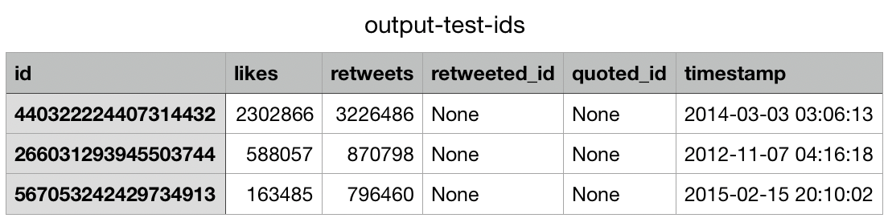

# Files

### Included:

* **classes.py** defines classes used in other scripts
* **hydrate.py** hydrates a `.txt` file of Tweet IDs into a new `.jsonl` file of full Tweet objects
* **tweets.py** processes a `.jsonl` file of Tweet objects and outputs a new `.csv` file of computed values
* **collate.py** processes a `.csv` file of Tweet values and outputs new `.csv` files of values bucketed per period _P_ (defaulting to 24 hours/ one UTC+0 day)
* **entropy.py** processes a directory of `.csv` files of bucketed Tweets and outputs a new `.csv`  file of calculated descriptive statistics, including Shannon Entropy, of topic over time
* **plotting.py** ...??? as of yet

### Not included:

A file called **secrets.py** containing a declaration as follows...

```python
from twarc import Twarc

def initialised_twarc_object():
    consumer_key = "<your Twitter app API consumer key>"
    consumer_secret = "<your Twitter app API consumer secret>"
    access_token = "<your Twitter app API access token>"
    access_token_secret = "<your Twitter app API access token secret>"

    return Twarc(consumer_key, consumer_secret, access_token, access_token_secret)
```
### Usage

It is assumed these files will be used either in isolation or in a pipeline sequence as follows:

Taking an input dataset of **line-separated Tweet ID values** in one or more `.txt` files, named **testids.txt** for this example:

```bash
$ python hydrate testids.txt
# outputs testids.jsonl + missed-testids.txt

$ python tweets testids.jsonl
# outputs output-testids.csv

$ python collate output-testids.csv
# outputs multiple files output-testids/output-testids-<date>.csv

$ python entropy output-testids
# outputs output-testids/entropy.csv
```

A function or bash script could easily be written to automate these steps, but I kept them separate so as to distribute them among machines and because I was frequently tweaking things and redoing steps.

Files in this project have been intended for use and tested with **Python 3.6**, but presumably would also run in quite a few other versions due to conscious decisions made about libraries and functions used.

## classes.py

A utility file of classes used in other scripts hereafter. The classes contained are as follows...

### `FileComponents`

| Attribute | Description |
|:---|:---|
| `absolute_path` | The full path (from OS root, including file) of the init filepath  |
| `path` | The full path (from OS root, excluding file) of the init filepath  |
| `name ` | The file name component (excluding path and extension) of the init filepath |
| `extension` | The file extension component (excluding name and extension) of the init filepath  |

**e.g.** in `/some/path/to/an/imaginary.file`, the whole thing is the absolute path. `/some/path/to/an/` is the path, `imaginary` is the name and `file` is the extension.

### `Tweet`

| Attribute | Description |
|:---|:---|
| `id` | `int` representation of Tweet identifier |
| `text` | `string` representation of Tweet body text (UTF-8 encoded) |
| `likes` | `int` representation of how many times the Tweet has been favourited |
| `retweets` | `int` representation of how many times the Tweet has been retweeted |
| `retweeted_id` | if `is_retweet`: `int` representation of original Tweet identifier, else `None` |
| `quoted_id` | if `is_quote_tweet`: `int` representation of quoted Tweet identifier, else `None`|
| `timestamp` | `string` representation of time Tweet was posted (in %Y-%m-%d %H:%M:%S format)|

## hydrate.py

### Inputs

| Flag | Description | Default |
|:---|:---|:---|
| None | the `.txt` file of Tweet IDs to attempt hydration of (**required value**) |
| `-c`/`--checkpoint` | the number of Tweet IDs to process at a time before printing indication of progress | 50,000 |

### Outputs

A `.jsonl` file of hydrated Tweet object values, omitting any that were deleted, from a private account, or otherwise un-fetchable. For information on Twitter's JSON format, see [Twitter's documentation on the topic](https://developer.twitter.com/en/docs/tweets/data-dictionary/overview/tweet-object).

### Example usage

`$ python hydrate testids.txt`

```
Executing: hydrate.py
==> Requesting tweet ids from: test-ids.txt
==> Outputting fetched tweets to: test-ids.jsonl


Split input into 1 files...
Loaded new ids into memory...
Attempted hydration of batch 1 / 1 complete (3 tweets fetched)...

Complete: hydrated 3 / 3 Tweet ids.
```

## tweets.py

### Inputs

| Flag | Description | Default |
|:---|:---|:---|
| None | the `.jsonl` file of hydrated Tweets (in JSON Lines representation) | None (**required value**) |
| `-o`/`--output` | the `.csv` file to create with derived Tweet values | input file with `output-` prefix on filename |
| `-c`/`--checkpoint` | the number of Tweet objects to process at a time before printing indication of progress | 50,000 |

### Outputs

A `.csv` file of the values from each initialised Tweet object, laid out as follows...



### Example usage

`$ python tweets testids.jsonl`

```
Executing: tweets.py
==> Parsing tweets from: test-ids.jsonl
==> Outputting values to: output-test-ids.csv


CHECKPOINT (line 0)

Complete: processed 3 tweets
```

## collate.py

### Inputs

| Flag | Description | Default |
|:---|:---|:---|
| None | the `.csv` file of hydrated Tweets to parse and bucket by values | None (**required value**) |
| `-c`/`--checkpoint` | the number of Tweet objects to process at a time before printing indication of progress | 50,000 |

### Outputs

A directory of `.csv` files where the input file has been sorted by UTC+0 date.

### Example usage

`$ python collate output-test-ids.csv`

```
Executing: collate.py
==> Getting ids from: output-test-ids.csv
==> Splitting into groups by date
==> Outputting ids to: output-test-ids/output-test-ids-<date>.csv files


Sorting of batch 0 / 0 complete (0 tweets sorted)...

Complete: split 3 tweets among 3 files
```

## entropy.py

### Inputs

| Flag | Description | Default |
|:---|:---|:---|
| None | the directory of `.csv` files to read in | None (**required value**) |

### Outputs

A `.csv` file of descriptive statistics, including approximation of Shannon Entropy, for both each day and cumulative values over time.


### Example usage

`$ python entropy output-test-ids`

```
Calculated entropy for 2012-11-07
Calculated entropy for 2014-03-03
Calculated entropy for 2015-02-15
```

## plotting.py

*Not yet implemented.*
